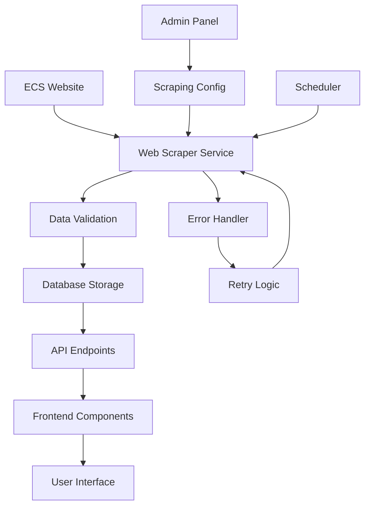

# ECS Web Scraping Integration - Product Requirements Document

## 1. Product Overview

A comprehensive web scraping system that extracts structured data from the Bangladesh Election Commission website (https://www.ecs.gov.bd/) and seamlessly integrates it into the existing Next.js application. The system will automatically capture news, notices, voter information, election schedules, and officer details while maintaining data integrity and providing real-time updates to users.

The product addresses the need for automated data synchronization between the official ECS website and the redesigned application, ensuring users always have access to the most current election-related information. This solution targets government officials, citizens, and stakeholders who require reliable access to election commission data.

## 2. Core Features

### 2.1 User Roles

| Role | Registration Method | Core Permissions |
|------|---------------------|------------------|
| Public User | No registration required | Can view all scraped data, browse news and notices |
| Admin User | System-level access | Can manage scraping schedules, view scraping logs, configure data sources |

### 2.2 Feature Module

Our ECS Web Scraping Integration consists of the following main pages:
1. **Data Dashboard**: Real-time scraping status, data freshness indicators, error monitoring.
2. **News Management**: Automated news extraction, categorization, and display integration.
3. **Notices Management**: Notice scraping, priority classification, and notification system.
4. **Officers Directory**: Officer information extraction, hierarchy mapping, and contact details.
5. **Election Data**: Voter statistics, election schedules, and constituency information.
6. **Admin Panel**: Scraping configuration, data validation rules, and system monitoring.

### 2.3 Page Details

| Page Name | Module Name | Feature description |
|-----------|-------------|---------------------|
| Data Dashboard | Status Monitor | Display real-time scraping status, last update timestamps, data freshness indicators |
| Data Dashboard | Error Tracking | Show scraping errors, failed requests, data validation failures with detailed logs |
| News Management | News Scraper | Extract news articles with titles, content, dates, categories, and images |
| News Management | Content Parser | Parse Bengali and English content, extract metadata, handle rich text formatting |
| News Management | News Display | Integrate scraped news into existing NewsSection component with proper styling |
| Notices Management | Notice Extractor | Scrape official notices, circulars, and announcements with priority levels |
| Notices Management | Classification | Categorize notices by type, urgency, and target audience |
| Notices Management | Notification System | Alert users about new high-priority notices and updates |
| Officers Directory | Officer Scraper | Extract officer profiles, positions, contact information, and organizational hierarchy |
| Officers Directory | Data Validation | Validate officer information, check for duplicates, maintain data consistency |
| Officers Directory | Directory Display | Integrate officer data into OfficersSection with search and filter capabilities |
| Election Data | Voter Statistics | Scrape voter registration numbers, demographic data, and constituency information |
| Election Data | Schedule Extractor | Extract election dates, polling schedules, and important deadlines |
| Election Data | Results Parser | Capture election results, vote counts, and statistical data when available |
| Admin Panel | Scraping Config | Configure scraping intervals, target URLs, and data extraction rules |
| Admin Panel | Data Validation | Set validation rules, data quality checks, and error handling policies |
| Admin Panel | System Monitor | Monitor system performance, scraping success rates, and data integrity metrics |

## 3. Core Process

**Public User Flow:**
Users visit the application and automatically see the most recent data scraped from the ECS website. The system continuously updates content in the background, ensuring users always have access to current information without manual intervention.

**Admin User Flow:**
Administrators access the admin panel to configure scraping parameters, monitor system health, and manage data validation rules. They can trigger manual scraping sessions, review error logs, and adjust scraping frequencies based on data update patterns.

**Data Scraping Process:**
The system automatically scrapes the ECS website at configured intervals, validates extracted data, stores it in the database, and updates the frontend components. Error handling ensures failed scraping attempts are logged and retried with exponential backoff.

## 4. User Interface Design

### 4.1 Design Style

- **Primary Colors**: Government blue (#1e40af), official green (#059669) for success states
- **Secondary Colors**: Warning amber (#f59e0b), error red (#dc2626), neutral gray (#6b7280)
- **Button Style**: Rounded corners with subtle shadows, consistent with existing Radix UI components
- **Font**: Inter for English content, Noto Sans Bengali for Bengali text, 16px base size
- **Layout Style**: Card-based design with clean spacing, top navigation consistent with existing header
- **Icons**: Lucide React icons for consistency, custom icons for ECS-specific elements

### 4.2 Page Design Overview

| Page Name | Module Name | UI Elements |
|-----------|-------------|-------------|
| Data Dashboard | Status Monitor | Real-time status cards with green/red indicators, progress bars for scraping completion, timestamp displays with relative time formatting |
| Data Dashboard | Error Tracking | Error log table with severity levels, expandable error details, retry buttons with loading states |
| News Management | News Display | Card layout matching existing NewsSection, image thumbnails, category badges, publication dates |
| Notices Management | Notice Display | Priority-based color coding, urgent notice banners, collapsible content sections |
| Officers Directory | Directory Display | Grid layout with officer photos, contact cards, hierarchical organization chart |
| Admin Panel | Configuration | Form inputs with validation, toggle switches for features, tabbed interface for different settings |

### 4.3 Responsiveness

The application is mobile-first responsive, optimizing for both desktop administration and mobile public access. Touch interactions are optimized for mobile users browsing news and notices, while desktop users get enhanced admin panel functionality with keyboard shortcuts and detailed data views.