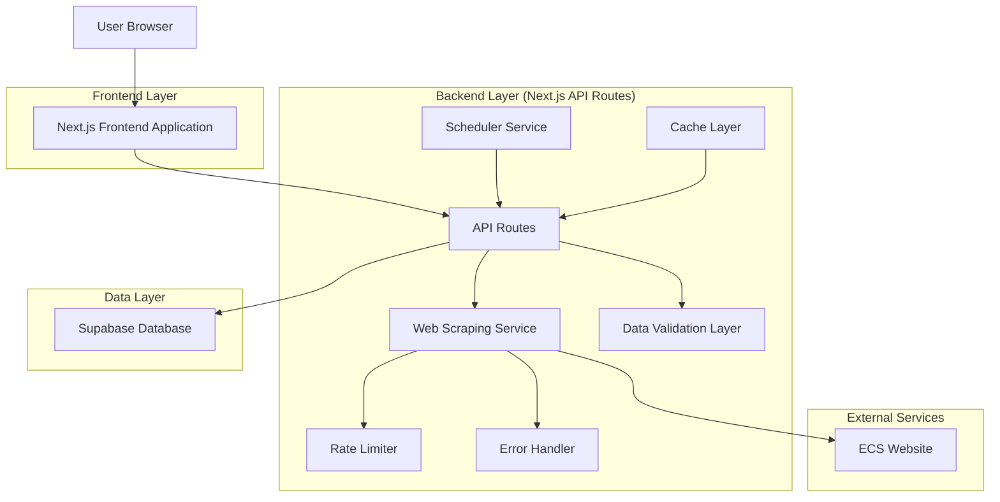
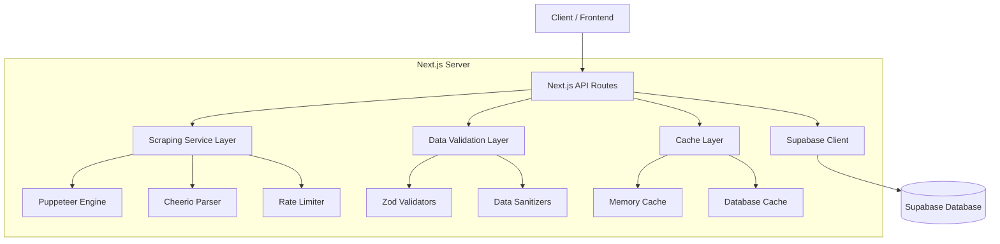
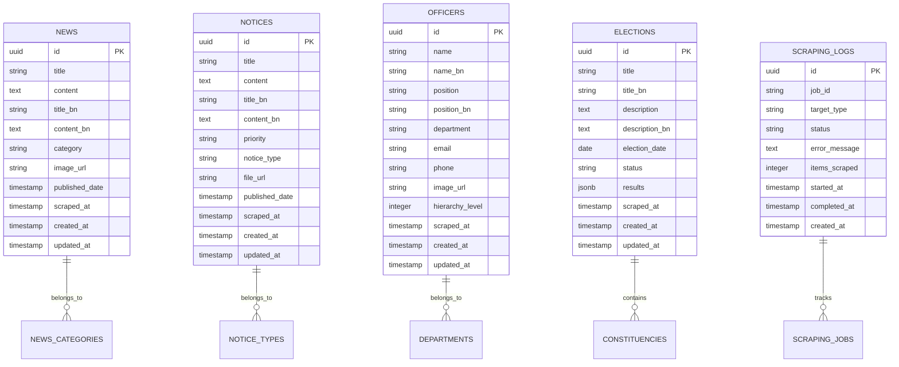

# ECS Web Scraping Integration - Technical Architecture Document

## 1. Architecture Design



## 2. Technology Description

- Frontend: React@19 + Next.js@15 + TypeScript + Tailwind CSS + Radix UI
- Backend: Next.js API Routes + Node.js
- Database: Supabase (PostgreSQL)
- Scraping: Puppeteer + Cheerio
- Caching: Node-cache + Redis (optional)
- Validation: Zod
- Scheduling: Node-cron

## 3. Route Definitions

| Route | Purpose |
|-------|---------|
| / | Home page with integrated scraped data display |
| /admin | Admin dashboard for scraping management and monitoring |
| /admin/scraping | Scraping configuration and manual trigger interface |
| /admin/logs | Error logs and scraping history viewer |
| /api/scrape | Manual scraping trigger endpoint |
| /api/data/news | News data API endpoint |
| /api/data/notices | Notices data API endpoint |
| /api/data/officers | Officers data API endpoint |
| /api/data/elections | Election data API endpoint |
| /api/admin/config | Scraping configuration management |
| /api/admin/logs | System logs and monitoring data |

## 4. API Definitions

### 4.1 Core API

**Data Scraping Trigger**
```
POST /api/scrape
```

Request:
| Param Name | Param Type | isRequired | Description |
|------------|------------|------------|-------------|
| target | string | false | Specific data type to scrape (news, notices, officers, elections) |
| force | boolean | false | Force scraping even if recently updated |

Response:
| Param Name | Param Type | Description |
|------------|------------|-------------|
| success | boolean | Scraping operation status |
| message | string | Operation result message |
| jobId | string | Unique identifier for tracking scraping job |

**News Data Retrieval**
```
GET /api/data/news
```

Request:
| Param Name | Param Type | isRequired | Description |
|------------|------------|------------|-------------|
| limit | number | false | Number of news items to return (default: 10) |
| offset | number | false | Pagination offset |
| category | string | false | Filter by news category |

Response:
| Param Name | Param Type | Description |
|------------|------------|-------------|
| data | NewsItem[] | Array of news items |
| total | number | Total count of available news items |
| lastUpdated | string | ISO timestamp of last data update |

**Notices Data Retrieval**
```
GET /api/data/notices
```

Request:
| Param Name | Param Type | isRequired | Description |
|------------|------------|------------|-------------|
| limit | number | false | Number of notices to return (default: 10) |
| priority | string | false | Filter by priority level (high, medium, low) |

Response:
| Param Name | Param Type | Description |
|------------|------------|-------------|
| data | NoticeItem[] | Array of notice items |
| total | number | Total count of available notices |
| lastUpdated | string | ISO timestamp of last data update |

## 5. Server Architecture Diagram



## 6. Data Model

### 6.1 Data Model Definition



### 6.2 Data Definition Language

**News Table**
```sql
-- Create news table
CREATE TABLE news (
    id UUID PRIMARY KEY DEFAULT gen_random_uuid(),
    title VARCHAR(500) NOT NULL,
    content TEXT,
    title_bn VARCHAR(500),
    content_bn TEXT,
    category VARCHAR(100),
    image_url TEXT,
    published_date TIMESTAMP WITH TIME ZONE,
    scraped_at TIMESTAMP WITH TIME ZONE DEFAULT NOW(),
    created_at TIMESTAMP WITH TIME ZONE DEFAULT NOW(),
    updated_at TIMESTAMP WITH TIME ZONE DEFAULT NOW()
);

-- Create indexes
CREATE INDEX idx_news_category ON news(category);
CREATE INDEX idx_news_published_date ON news(published_date DESC);
CREATE INDEX idx_news_scraped_at ON news(scraped_at DESC);

-- Grant permissions
GRANT SELECT ON news TO anon;
GRANT ALL PRIVILEGES ON news TO authenticated;
```

**Notices Table**
```sql
-- Create notices table
CREATE TABLE notices (
    id UUID PRIMARY KEY DEFAULT gen_random_uuid(),
    title VARCHAR(500) NOT NULL,
    content TEXT,
    title_bn VARCHAR(500),
    content_bn TEXT,
    priority VARCHAR(20) DEFAULT 'medium' CHECK (priority IN ('high', 'medium', 'low')),
    notice_type VARCHAR(100),
    file_url TEXT,
    published_date TIMESTAMP WITH TIME ZONE,
    scraped_at TIMESTAMP WITH TIME ZONE DEFAULT NOW(),
    created_at TIMESTAMP WITH TIME ZONE DEFAULT NOW(),
    updated_at TIMESTAMP WITH TIME ZONE DEFAULT NOW()
);

-- Create indexes
CREATE INDEX idx_notices_priority ON notices(priority);
CREATE INDEX idx_notices_published_date ON notices(published_date DESC);
CREATE INDEX idx_notices_type ON notices(notice_type);

-- Grant permissions
GRANT SELECT ON notices TO anon;
GRANT ALL PRIVILEGES ON notices TO authenticated;
```

**Officers Table**
```sql
-- Create officers table
CREATE TABLE officers (
    id UUID PRIMARY KEY DEFAULT gen_random_uuid(),
    name VARCHAR(200) NOT NULL,
    name_bn VARCHAR(200),
    position VARCHAR(200),
    position_bn VARCHAR(200),
    department VARCHAR(200),
    email VARCHAR(255),
    phone VARCHAR(50),
    image_url TEXT,
    hierarchy_level INTEGER DEFAULT 0,
    scraped_at TIMESTAMP WITH TIME ZONE DEFAULT NOW(),
    created_at TIMESTAMP WITH TIME ZONE DEFAULT NOW(),
    updated_at TIMESTAMP WITH TIME ZONE DEFAULT NOW()
);

-- Create indexes
CREATE INDEX idx_officers_department ON officers(department);
CREATE INDEX idx_officers_hierarchy ON officers(hierarchy_level);
CREATE INDEX idx_officers_name ON officers(name);

-- Grant permissions
GRANT SELECT ON officers TO anon;
GRANT ALL PRIVILEGES ON officers TO authenticated;
```

**Elections Table**
```sql
-- Create elections table
CREATE TABLE elections (
    id UUID PRIMARY KEY DEFAULT gen_random_uuid(),
    title VARCHAR(500) NOT NULL,
    title_bn VARCHAR(500),
    description TEXT,
    description_bn TEXT,
    election_date DATE,
    status VARCHAR(50) DEFAULT 'upcoming' CHECK (status IN ('upcoming', 'ongoing', 'completed', 'cancelled')),
    results JSONB,
    scraped_at TIMESTAMP WITH TIME ZONE DEFAULT NOW(),
    created_at TIMESTAMP WITH TIME ZONE DEFAULT NOW(),
    updated_at TIMESTAMP WITH TIME ZONE DEFAULT NOW()
);

-- Create indexes
CREATE INDEX idx_elections_date ON elections(election_date DESC);
CREATE INDEX idx_elections_status ON elections(status);
CREATE INDEX idx_elections_results ON elections USING GIN(results);

-- Grant permissions
GRANT SELECT ON elections TO anon;
GRANT ALL PRIVILEGES ON elections TO authenticated;
```

**Scraping Logs Table**
```sql
-- Create scraping logs table
CREATE TABLE scraping_logs (
    id UUID PRIMARY KEY DEFAULT gen_random_uuid(),
    job_id VARCHAR(100) NOT NULL,
    target_type VARCHAR(50) NOT NULL,
    status VARCHAR(20) DEFAULT 'running' CHECK (status IN ('running', 'completed', 'failed', 'cancelled')),
    error_message TEXT,
    items_scraped INTEGER DEFAULT 0,
    started_at TIMESTAMP WITH TIME ZONE DEFAULT NOW(),
    completed_at TIMESTAMP WITH TIME ZONE,
    created_at TIMESTAMP WITH TIME ZONE DEFAULT NOW()
);

-- Create indexes
CREATE INDEX idx_scraping_logs_job_id ON scraping_logs(job_id);
CREATE INDEX idx_scraping_logs_target_type ON scraping_logs(target_type);
CREATE INDEX idx_scraping_logs_status ON scraping_logs(status);
CREATE INDEX idx_scraping_logs_started_at ON scraping_logs(started_at DESC);

-- Grant permissions
GRANT SELECT ON scraping_logs TO authenticated;
GRANT ALL PRIVILEGES ON scraping_logs TO authenticated;
```

**Initial Configuration Data**
```sql
-- Insert initial scraping configuration
INSERT INTO scraping_logs (job_id, target_type, status, items_scraped, completed_at)
VALUES 
    ('init-001', 'news', 'completed', 0, NOW()),
    ('init-002', 'notices', 'completed', 0, NOW()),
    ('init-003', 'officers', 'completed', 0, NOW()),
    ('init-004', 'elections', 'completed', 0, NOW());
```